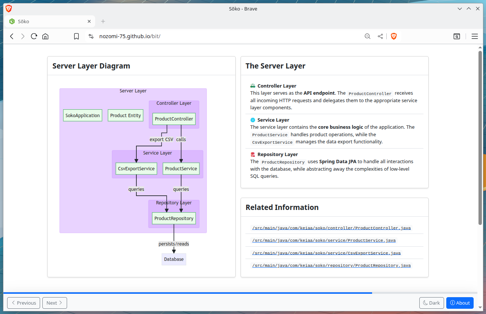

# bit

Present your ideas, one bit at a time.



**bit** is a lightweight, static Single Page Application (SPA) designed for creating and presenting slide-based content. It leverages **Bootstrap 5**, **Mermaid.js**, and **vanilla JavaScript** to deliver a clean, responsive, and customizable presentation experience.

## Features

- **Slide-based presentation**: Dynamically loads slides from HTML partials.
- **Mermaid integration**: Easily embed flowcharts and diagrams using Mermaid.js.
- **Theme toggle**: A persistent theme toggle that remembers your preference across sesssions.
- **Progress bar**: Visually track your progress through the presentation deck.
- **Responsive design**: The application works seamlessly on both desktop and mobile devices.

## Project Structure

```bash
bit/
├── index.html          # Main entry point of the application
├── config.js           # Application configuration (app name and slide order)
├── partials/           # HTML fragments for slides and modals
│   ├── about.html
│   └── slide1.html
├── src/                # JavaScript modules
│   ├── app.js
│   ├── mermaid.js
│   ├── router.js
│   └── theme.js
│   └── utils.js
└── styles/             # Custom CSS files
    ├── mermaid.css
    └── styles.css
```

## Setup

### Development

To run **bit** locally, you can use any simple static server. A quick way to get started is by using Python's built-in `http.server` module, 'cuz it just werkz.

```bash
# From the project root directory, run the following command:
python3 -m http.server 8080
```

Then, open your web browser and navigate to `http://localhost:8080` to view the presentation. You may replace `8080` with the port of your liking.

### Deployment

Since this is a static project, it can be hosted on platforms like GitHub Pages or any other static hosting service. Simply ensure that all project files are included in your repository.

### Configuration

The entire application configuration is handled in the `config.js` file.

```javascript
export const config = {
  appName: "Sōko",
  slides: [
    "partials/slide1.html",
    "partials/slide2.html",
    "partials/slide3.html",
  ]
};

```

- `appName`: The display name for your presentation.
- `slides`: An array of file paths to your slide HTML partials, which will be loaded in the specified order.

## Credits

- **Bootstrap**: For the responsive design and components.
- **Bootstrap Icons**: For the various icons used throughout the app.
- **Mermaid.js**: For rendering diagrams and charts.